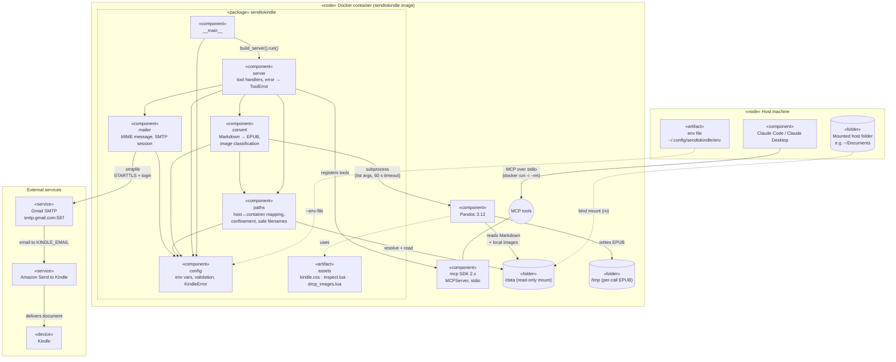

# Design diagrams

UML diagrams for sendtokindle, written in [Mermaid](https://mermaid.js.org/) so GitHub renders them inline. Mermaid has no native UML component or activity diagram types, so both are flowcharts that use UML notation.

## Component diagram

Shows how the system is structured: the Python modules inside the container, the `mcp` SDK and Pandoc they depend on, and the external parts (Claude client, mounted folder, env file, Gmail SMTP, Amazon and the Kindle).

Notation:
- Solid arrows are dependencies (imports and calls).
- Dashed arrows are configuration, mounts and resource use.
- The circle is the provided MCP tools interface.

## Activity diagram

Shows how data flows through a `send_markdown` or `send_pdf` call.

Notation:
- The filled circle at the top is the start (initial node), and the one at the bottom is the end (activity final).
- Diamonds are decisions.
- Mermaid can't draw swimlanes, so each action is coloured by who performs it, and the participant is named in brackets: **[Claude]** client (purple), sendtokindle server (white), **[Pandoc]** (orange), **[Gmail]** SMTP (blue) and **[Amazon]** Send to Kindle (green).
- Each red ⊗ node is a tool error that ends the flow. It is returned to Claude with `isError: true`.
- The black bars fork and join the two concurrent flows after Gmail accepts the message. The tool returns its result while Amazon delivers to the Kindle asynchronously.

```mermaid
flowchart TB
    start(( )):::initial
    calltool["[Claude] Call tool over MCP stdio<br/>(host path, optional title / author / filename)"]:::client
    loadcfg["Load configuration from environment<br/>(config.require_config)"]
    cfgok{"Configuration<br/>valid?"}
    e1(["⊗ Tool error:<br/>Missing configuration: …"]):::error
    resolve["Map host path to container path<br/>(HOST_DATA_DIR → DATA_DIR), resolve symlinks<br/>(paths.resolve_input)"]
    pathok{"Inside mount, correct<br/>extension, exists, within<br/>size limit?"}
    e2(["⊗ Tool error:<br/>outside mount / not found / too large"]):::error
    which{"Which tool?"}

    defaults["Write defaults.json<br/>(DEFAULT_AUTHOR, DEFAULT_LANGUAGE)"]
    inspect["[Pandoc] Inspect document with inspect.lua<br/>→ title, author, first H1, image sources (JSON)"]:::pandoc
    title["Resolve title<br/>(argument → front matter → first H1 → filename)"]
    classify["Classify each image<br/>(data: keep · remote / outside mount / missing → block)"]
    convert["[Pandoc] Convert Markdown → EPUB 3<br/>(drop_images.lua removes blocked images,<br/>kindle.css, monochrome highlighting, TOC)"]:::pandoc
    epubok{"EPUB produced<br/>and within<br/>size limit?"}
    e3(["⊗ Tool error:<br/>Pandoc failed … / too large"]):::error
    epub["Attachment = EPUB in temporary directory<br/>Subject = resolved title"]

    pdfok{"File starts<br/>with %PDF- ?"}
    e4(["⊗ Tool error:<br/>not a valid PDF file"]):::error
    pdf["Attachment = original PDF (unchanged)<br/>Subject = filename stem (never 'Convert')"]

    merge{ }
    build["Build MIME email<br/>(From SENDER_EMAIL, To KINDLE_EMAIL, one attachment)<br/>(mailer.build_message)"]
    smtp["[Gmail] STARTTLS / SSL, log in, receive message"]:::gmail
    sent{"Login and send<br/>accepted?"}
    e5(["⊗ Tool error:<br/>login rejected / refused / cannot connect"]):::error
    fork["&nbsp;"]:::bar

    cleanup["Delete temporary files"]
    summary["Return summary<br/>(filename, size, masked Kindle address, warnings)"]
    show["[Claude] Show result to the user"]:::client
    deliver["[Amazon] Deliver document to Kindle<br/>(asynchronous, usually 1–5 min)"]:::amazon
    confirm["[Amazon] Email confirmation to sender"]:::amazon

    join["&nbsp;"]:::bar
    done((( ))):::final

    start --> calltool --> loadcfg --> cfgok
    cfgok -- no --> e1
    cfgok -- yes --> resolve --> pathok
    pathok -- no --> e2
    pathok -- yes --> which

    which -- send_markdown --> defaults --> inspect --> title --> classify --> convert --> epubok
    epubok -- no --> e3
    epubok -- yes --> epub --> merge

    which -- send_pdf --> pdfok
    pdfok -- no --> e4
    pdfok -- yes --> pdf --> merge

    merge --> build --> smtp --> sent
    sent -- no --> e5
    sent -- yes --> fork

    fork --> cleanup --> summary --> show --> join
    fork --> deliver --> confirm --> join
    join --> done

    classDef initial fill:#222,stroke:#222,color:#222
    classDef final fill:#222,stroke:#222,color:#222
    classDef bar fill:#222,stroke:#222,color:#222,font-size:2px,padding:0
    classDef error fill:#FDE2E2,stroke:#C53030,color:#222
    classDef client fill:#EDE4FA,stroke:#6B46C1,color:#222
    classDef pandoc fill:#FDEBD3,stroke:#C05621,color:#222
    classDef gmail fill:#DCEBFA,stroke:#2B6CB0,color:#222
    classDef amazon fill:#DDF3E4,stroke:#2F855A,color:#222
```

